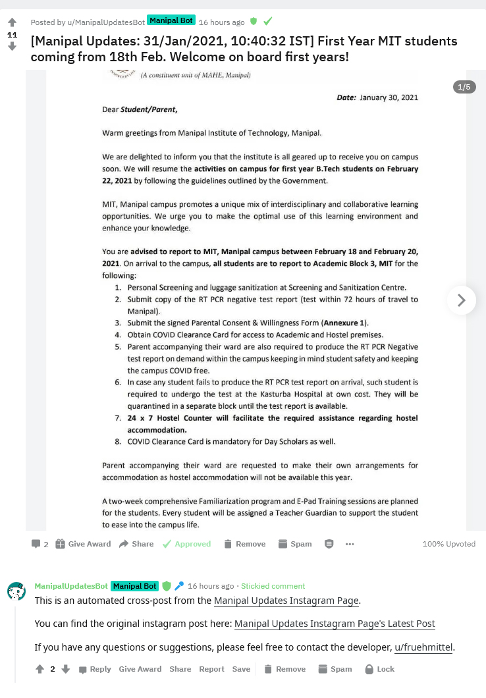

# About

A reddit bot that automatically cross-posts updates posted on the [Manipal Updates Instagram Page](https://www.instagram.com/manipalupdates/) to reddit on the subreddit [r/manipal](https://www.reddit.com/r/manipal/) and links to the original instagram post in the comments.

<h1>Instructions</h1>

1. Make sure you have Python 3.6* installed and working, preferably in a virtual environment. 

2. Clone the repository:

`git clone https://github.com/RahulShagri/Instagram-to-Reddit-Bot.git`

3. Install prerequisites using pip, preferably in a new environment:

`pip install -r requirements.txt`

4. Enter your PRAW and Instagram details in the code.

5. Run the manipal_updates_reddit_bot.py file.

<h2>Example post</h2>

